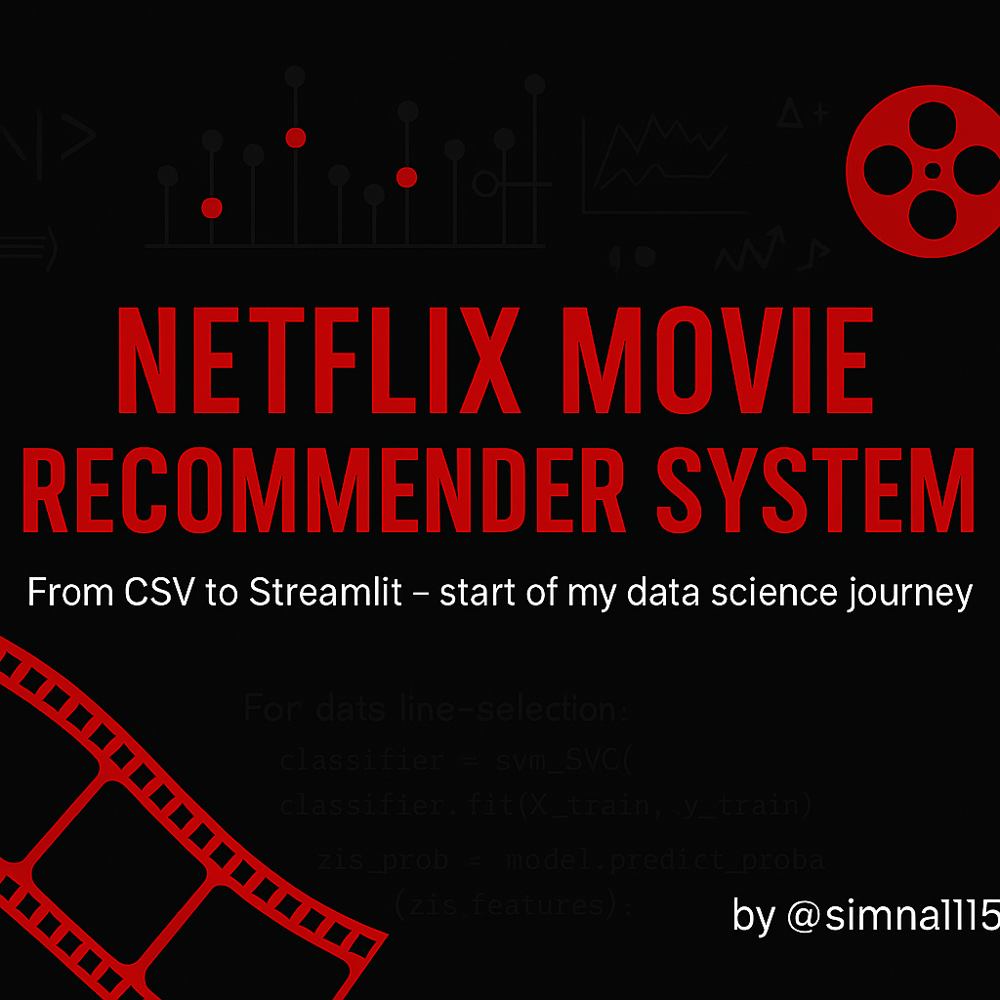
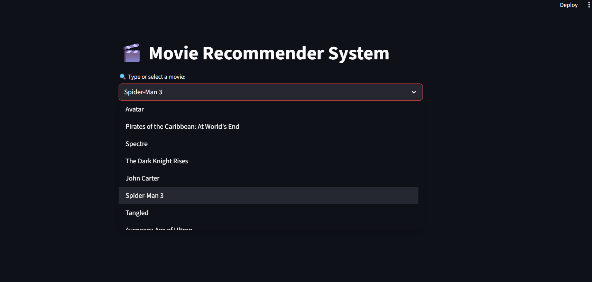
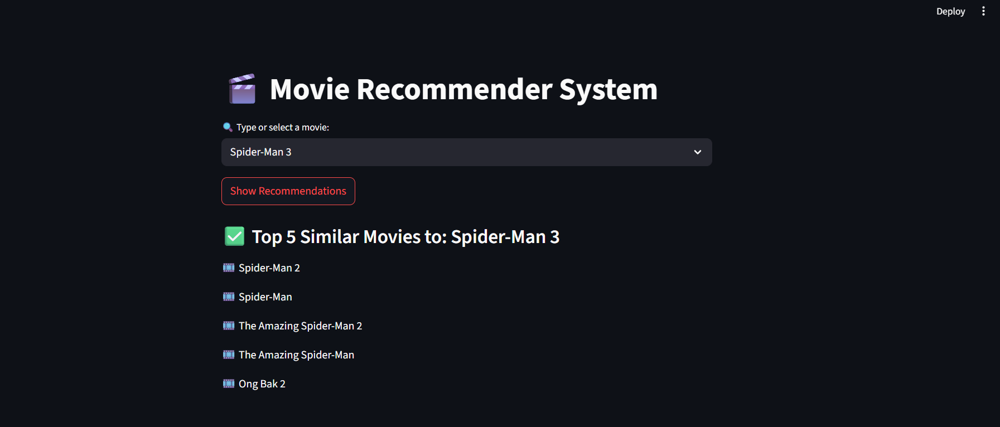

<p align="center">
  
</p>


# 🎬 Netflix Movie Recommender System

A simple and interactive content-based movie recommendation system built with **Python**, **Pandas**, **Scikit-learn**, and **Streamlit**. 
It helps users find movies similar to their favorite ones based on plot, cast, crew, genres, and keywords.

---

## 🚀 Features

- 🎬 **Content-Based Movie Recommendation**: Suggests movies based on similar content (genre, overview, cast, crew, etc.).
- 🔍 **Fuzzy Matching for Input**: Accepts close spellings of movie names (like _"Ironman"_ instead of _"Iron Man"_).
- 🧠 **Vectorization & Similarity Engine**: Uses **CountVectorizer** and **cosine similarity** to find related movies.
- 📂 **Modular Code Structure**: Clean separation of logic (`recommender.py`) and user interface (`app.py`).
- ⚡ **Fast and Lightweight**: Works locally without any heavy setup or external APIs.
- 🎯 **Search + Recommend**: Type or choose a movie from the dropdown and get the top 5 closest matches.
- 💻 **Streamlit Web App**: Runs as an interactive web application on `localhost`.
- 📦 **Customizable**: You can extend it by adding posters, overviews, links, or even real-time APIs.

---

## 🛠️ Tech Stack

- **Python**
- **Pandas & NumPy**
- **Scikit-learn (CountVectorizer & Cosine Similarity)**
- **difflib (for fuzzy logic)**
- **Streamlit (for front-end)**
- **Git & GitHub (for version control)**

---

## 📂 Folder Structure Diagram

```
NetflixRecommender/
│
├── data/
│ ├── tmdb_5000_movies.csv
│ └── tmdb_5000_credits.csv
│
├── model/
│ └── similarity.pkl (excluded from GitHub because it's too large)
│
├── screenshots/
│ ├── homepage.png
│ └── recommendation.png
│
├── recommender.py
├── app.py
├── requirements.txt
└── README.md
```

---

## 🛠️ How to Run

Follow these simple steps to run the Netflix Movie Recommender System on your local machine:

### 1. Clone the Repository
Clone this repository to your system using:

```
  git clone https://github.com/simna1115/NetflixRecommender.git
  cd NetflixRecommender
```

### 2. Install Required Python Libraries
Make sure Python and pip are installed. Then run:

```
  pip install -r requirements.txt
```

### 3. Add the similarity.pkl file manually
- The similarity.pkl file is too large for GitHub, so it's not included here.
- You must manually place it inside the model/ folder.
- If you don’t have it, you can generate it by running recommender.py

```
  NetflixRecommender/
  └── model/
      └── similarity.pkl
```

Without this file, the app will not work. This file contains precomputed similarity scores.

### 4. Run the Streamlit App
Now launch the app locally using this command:

```
streamlit run app.py
```
After running, Streamlit will open a new browser tab (or give you a link like http://localhost:8501) where you can try the app.

### 5. Use the Recommender! 🎬
- Start typing a movie name in the search bar.
- Select a title and click "Show Recommendations".
- Instantly get 5 similar movie suggestions!

---

## 📸 Screenshots

### 🏠 Homepage

  

### 🎯 Movie Recommendations

  

---

## 💡 Inspiration
This project started with a simple question:

```
"How does Netflix always know what I want to watch before I do?"
```

As someone transitioning into tech with zero prior experience, I built this project to prove to myself that I can turn ideas into real apps. Every part of this project - from cleaning the data to building the app interface - was a step in my learning journey.

I didn't just want to watch smart recommendations - I wanted to build one.

So I rolled up my sleeves, got tangled in datasets, misunderstood cosine similarity (more than once 😅), broke my app 40+ times, and still kept going - one bug and one breakthrough at a time.

This recommender isn't just about movies -
It's about learning to think like a developer, build real-world projects, and show that passion can write code too.

I hope it inspires someone else starting from zero like I did.

---

---

## 👨‍💻 Author

### **Vishal Singh**
**Aspiring Data Scientist | Learner at AlmaBetter | Python + ML Enthusiast | Ex-Soft Skills Trainer**

🚀 Passionate about building real-world ML projects from scratch  
📍 Based in India | 💬 Open to internships, collaborations, and job opportunities

📫 Reach me at: psvishal1115@gmail.com  
🔗 [GitHub](https://github.com/simna1115) • [LinkedIn](https://www.linkedin.com/in/dsvishal11)  
